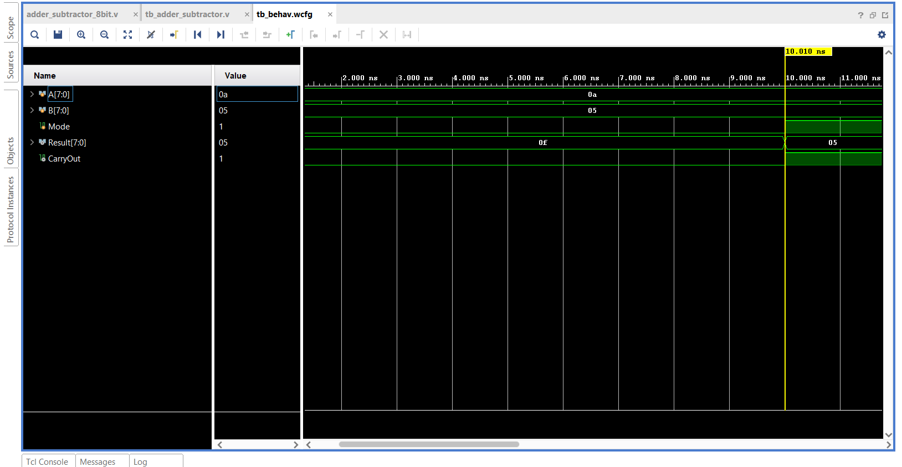
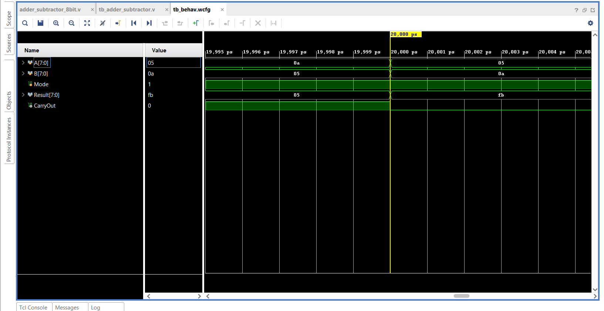
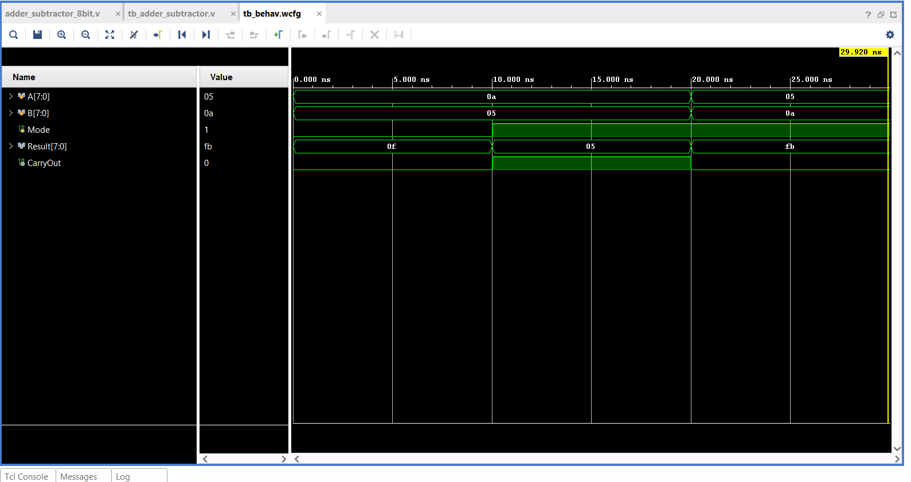

# 8-bit Adder/Subtractor (Verilog)

## Description
This project implements an 8-bit Adder/Subtractor using Verilog HDL. 
The design performs both addition and subtraction using 2’s complement logic.

## Tools Used
- Xilinx Vivado

## Working Principle
Subtraction is performed as:
A - B = A + (~B + 1)

Mode:
- 0 → Addition
- 1 → Subtraction

## Simulation Results

### Addition (10 + 5 = 15)

### Subtraction (10 - 5 = 5)

### Negative Result (5 - 10 = -5)

## Project Structure
